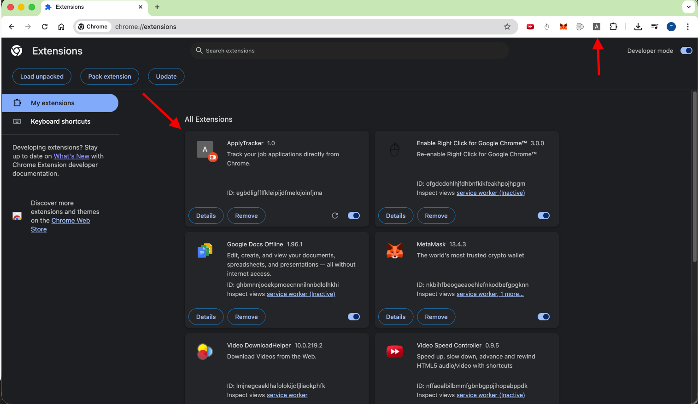
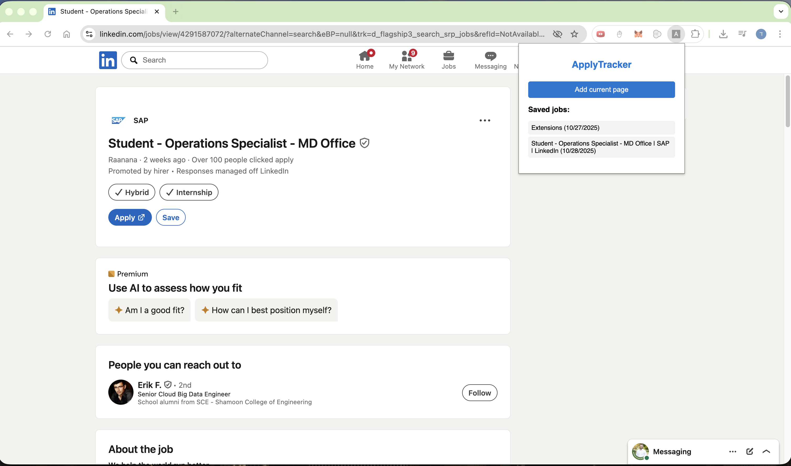

# ApplyTracker 

ApplyTracker is a simple Chrome extension that helps users keep track of the job applications they submit online.  
Each time you visit a job page, you can add it to your personal list with one click.

---

## Features
- Save job pages with title, URL, and date.
- View all your saved jobs directly from the popup.
- Data is stored locally on your browser (no external server).
- Built with basic OOP structure (Job, JobStorage classes).

---

## Tech Stack
- **JavaScript (ES6 modules)**  
- **HTML / CSS**  
- **Chrome Extension Manifest V3**

---

## Installation
1. Download or clone this repository:
   ```bash
   git clone https://github.com/danhason/applytracker.git

2.	Open Chrome and go to:
    chrome://extensions/

3.	Turn on Developer mode (top-right corner).

4.	Click Load unpacked and select the folder:
    applytracker/

5.	The extension will appear in your toolbar.
Click the puzzle icon and pin “ApplyTracker” to make it visible.

6.	Click the icon and test adding a page to your job list.
   ## Screenshots

## Screenshots

### Popup window


### Saved jobs list
